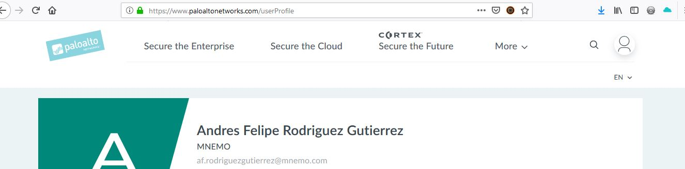
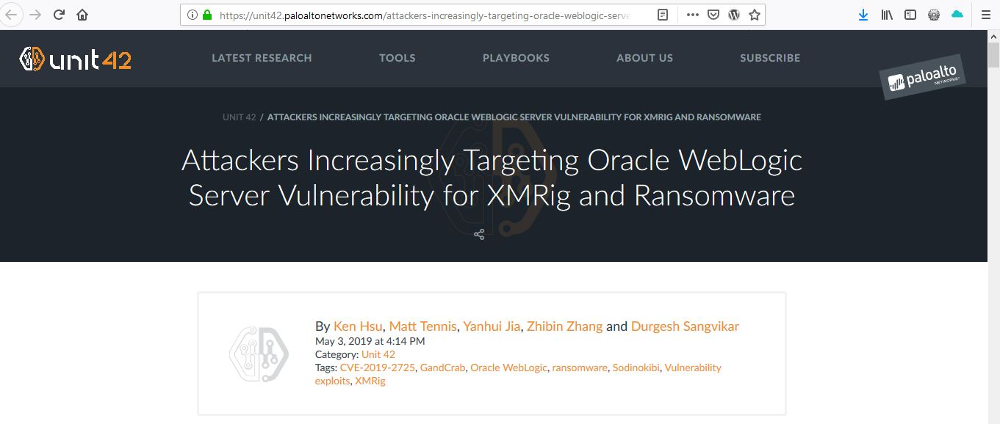

# Taller-2

## Amenazas para base de datos Oracle 12.2

### Fuente 1 - Paloalto Networks

Registro en el sitio https://www.paloaltonetworks.com/

Identificación de vulnerabilidad para la versión del motor de base datos:

### Fuente 2 IBM X-Force

Identificación de un reporte de vulnerabilidades para la versión del motor de base datos [Reporte IBM X-Force](https://github.com/pepachon/Taller-2/blob/master/X-Force-IBM_Vulnerabilities_Oracle_12_2_0_1.pdf)
